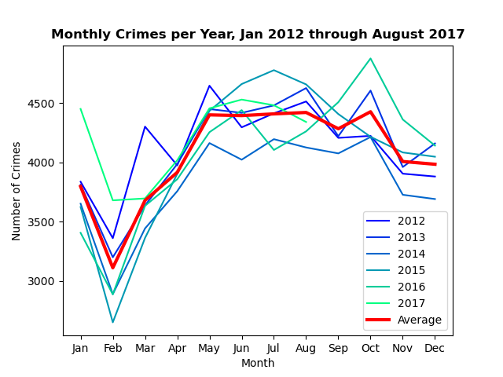
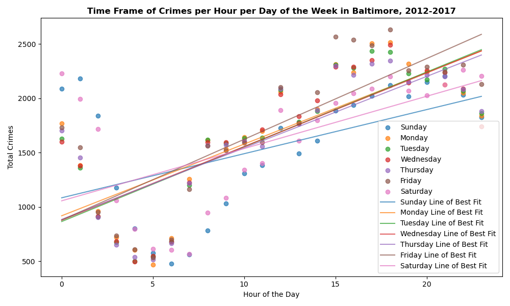
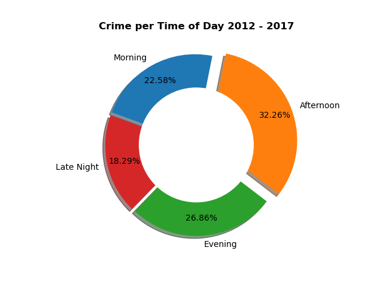
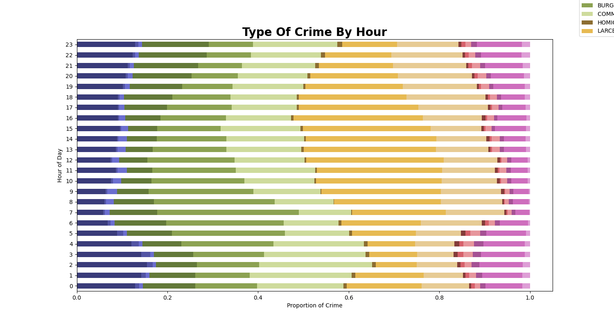
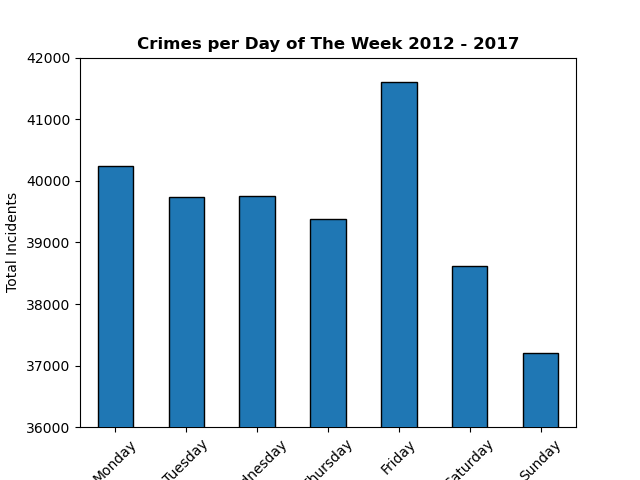
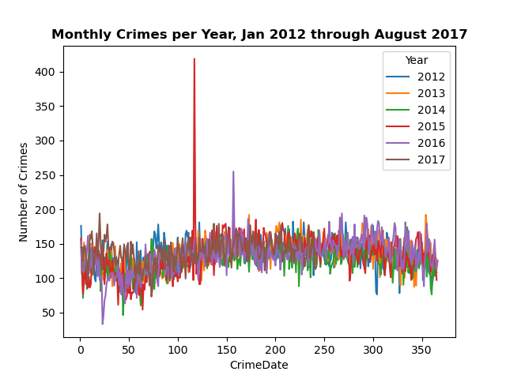

# GW-Project-1
## Project 1, 3 August 2023

Development on this project has stopped.

## Description

The Jupyter Notebook main.ipynb pulls data from Kaggle, based upon the city of Baltimore's  Open Baltimore data project, released to the public by the Baltimore Police Department to improve transparency in governance.

Kaggle data source: https://www.kaggle.com/datasets/sohier/crime-in-baltimore

Open Baltimore: https://www.baltimorepolice.org/crime-stats/open-data

The dataset represents the location and characteristics of major (Part 1) crime against persons, such as homicide, shooting, robbery, aggravated assault, etc., within the City of Baltimore. These Victim-Based crimes are collectively referred to as Part 1 crimes by the BPD.

The data set runs from the first of January, 2012 to the second of September, 2017.

The project analyzes the relationship between the frequency of crime and time of day, to better inform decision makers on the efficient allocation of police resources. We find a strong statistical association between the time of day, day of the week, and month of the year upon the frequency of crimes.

A written summary of the major findings is included in the repo root as "GW Project 1 Analysis.pdf".

A copy of the slides for presentation is included in the repo root as "slides.pdf".

## Usage

You can view the results in main.ipynb, located in the repository root. If you want to run the code, restart the kernel and 'run all'.

## Gallery of Significant Results:

Figure Title:

###### syntax for adding pictures

Monthly Crimes per year:

Linear Regression, frequency of crime per hour per day of the week:

Frequency of Crime by Time of Day:

Type of Crime per Hour:

Frequency of Crime by Day of the Week:

Major Outlier, Aftermath of the Death of Freddie Gray:

## Acknowledgments

Thanks to Geronimo Perez for feedback and assistance.

Assistance on the stacked bar charts came from ( https://python-charts.com/part-whole/stacked-bar-chart-matplotlib/ )

=======
## Authors

Siobhan Byrne, Bryan Johns, Katie Loosararian, and Robert Takan

August, 2023

